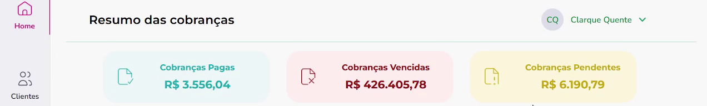

## It's me! Tomtom! 

Olá eu sou o **Bruno** mas pode me chamar de **Tomtom** :)

Sou um profissional experiente em diferentes campos, em transição de carreira para área de desenvolvimento de software.
Busco uma oportunidade de me desenvolver na área aplicando os conhecimentos adquiridos e adicionando novos.
Sou calmo e analítico, mas com senso de urgência. Comprometido e auto-motivado com metas e objetivos a serem alcançados.

  
**Tecnologias que uso atualmente:**

**Algumas tecnologias que quero aprender:** 

---

### Projetos Realizados:  

#### Gerenciador de Cobranças

O gerenciador de cobranças foi o desafio final (módulo 5) do curso de desenvolvimento de software da Cubos Academy. Foi realizado em equipe de 4 pessoas, 2 no front-end e 2 no back-end. Minha participação foi como front-end onde desenvolvi a página de cadastro de usuário, página de detalhe dos clientes, edição de dados dos clientes, edição de cobranças, exlusão de cobranças etc.

O aplicativo web foi feito em React e Node com as seguintes features:
   
 - Cadastro de Usuário;
 - Login com autenticação;
 - Página home com resumo geral das cobranças;
 - Edição de dados do usuário;
 - Cadastro e edição de dados de clientes;
 - Cadastro, edição e exclusão de cobranças.

**Aprendizados:** Foi muito bom o trabalho de equipe onde dividimos as tarefas usando **metodologia ágil** usando o Trello. Foi importante treinar a **leitura de código** aprendendo e interagindo com o outro desenvolvedor front-end e com os dois back-end. Também, a consulta e pesquisa na **documentação técnica** para resolver bugs ou implementar novas features usando o **material-ui**(MUI).

**Links:**  [Repo Github](https://github.com/Brunotomtom/Cubos_desafio_front_modulo_5)  |  [Deploy na Heroku](https://cobrancaapp.netlify.app/)  |  [Youtube video](https://youtu.be/2zWkbyazXds)
